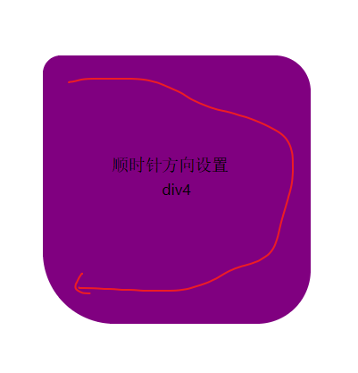

# CSS圆角边框

> 盒子不仅仅有矩形，还可以设置圆角，通过`border-radius`设置


## 基本使用

> 属性值： 长度单位 或 百分比，用属性值来设置边框圆角半径

+ 一个参数

  > 设置四个角的圆角半径

  ```
   .nav1 {
        height: 300px;
        width: 300px;
        background-color: pink;
        line-height: 300px;
        text-align: center;
        margin: 100px auto;
        border-radius: 20px;
      }
  ```

  

  

+ 两个参数

  > 设置`左上角、右下角` 和 `右上角、左下角`的边框半径

  ```
    .nav2 {
        height: 300px;
        width: 300px;
        line-height: 300px;
        text-align: center;
        background-color: red;
        margin: 100px auto;
        border-radius: 20px 40px;
      }
  ```

  

  

+ 三个参数

  > 设置`左上角`  `右上角、左下角` `右下角` 的边框半径

  ```
  .nav3 {
        height: 300px;
        width: 300px;
        line-height: 300px;
        text-align: center;
        background-color: lightblue;
        margin: 100px auto;
        border-radius: 20px 40px 60px;
      }
  ```

  

  

+ 四个参数

  > 按顺时针方向设置每个角的圆角边框

  ```
  .nav4 {
        height: 300px;
        width: 300px;
        line-height: 300px;
        text-align: center;
        background-color: purple;
        margin: 100px auto;
        border-radius: 20px 40px 60px 80px;
      }
  ```

  

  

  

+ 单独设置每个角的圆角边框

  ```
  .nav5 {
        height: 300px;
        width: 300px;
        line-height: 300px;
        text-align: center;
        background-color: pink;
        margin: 100px auto;
        border-top-left-radius: 10px;
        border-top-right-radius: 30px;
        border-bottom-right-radius: 50px;
        border-bottom-left-radius: 70px;
      }
  ```

  

## 圆角边框原理

> 是时候展示真正的技术了，上图


​	以第三个div为例，代码如下

```
.nav3 {
      height: 300px;
      width: 300px;
      line-height: 300px;
      text-align: center;
      background-color: lightblue;
      margin: 100px auto;
      border-radius: 20px 40px 60px;
    }
```

​	它的圆角边框的半径分别是: `左上：20px 右上 左下：40px 右下：60px` ，想象一下（看图），有三个半径为 20px 、40px、60px的圆跟盒子的四个角相切，很不是就明白了。