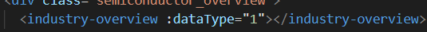
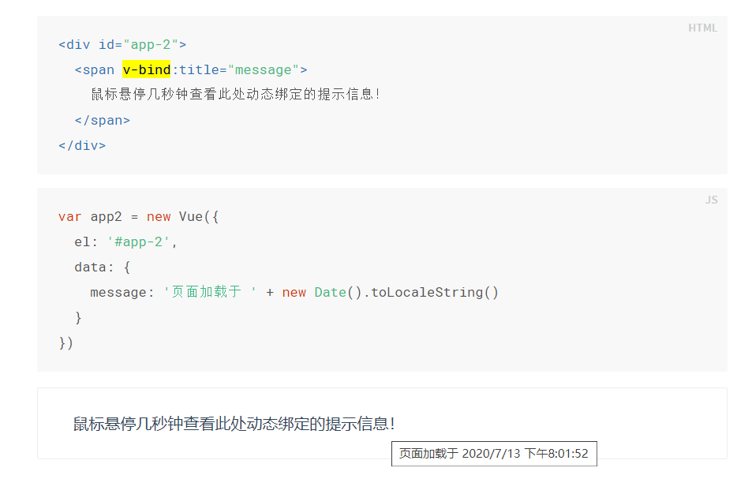
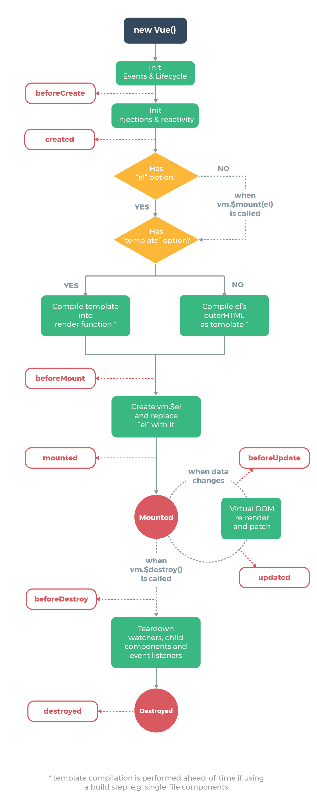

# Vue初识

### template



这些标签名的含义？

### script

**引入component**

这些字段的含义？

name

components

data

mounted

methods

### style 样式


*****

`v-xxx` 指令： 使用`v-xxx = '***'` ,赋值是使用字符串

```
v-bind
v-if
v-for：遍历data
v-on: 添加事件监听器
v-model:实现表单输入和应用状态之间的双向绑定
```

`组件`

在 Vue 里，一个组件本质上是一个拥有预定义选项的一个 Vue 实例

Vue.component('组件名',{...}) //中括号里面是一个对象

//属性		 说明
//template	  渲染模板，是html
//props		  外部传入参数，数组类型


```
new Vue({...})//中括号里面放的是一个对象
//属性     //说明
//el	   vue需要绑定的dom元素的 className/id
//data	   可渲染的数据
```

****

## 指令

> 指令的预期值是单个JavaScript表达式（v-for除外）。有一些指令可以接收''参数''，在指令名称之后以冒号表示

### v-bind

将元素节点的attribute和Vue实例的property保持一致，主要用于属性绑定。



span有title标签？ 悬停效果是怎么实现的？

#### 缩写

```
<!-- 完整语法 -->
<a v-bind:href="url">...</a>

<!-- 缩写 -->
<a :href="url">...</a>

<!-- 动态参数的缩写 (2.6.0+) -->
<a :[key]="url"> ... </a>
```

### v-if

控制dom元素的出现与消失

### v-for

遍历待渲染的数据，尽量使用v-for提供的`key` attribute。组件上使用v-for,key是必须的，如果想要将v-for遍历的数据注入到组件里面，需要使用组件的props（用`v-bind`绑定注入）

```
//可以使用in/of来遍历
v-for = "item in/of items"
//遍历数组时,可选第二个参数代表遍历的下标
v-for = "(item,index) in/of array"
//遍历对象时，可选三个参数（value，key/property，index）
v-for = "(value,key,index) in obj"
```

使用index作为`key` 时，在同一个class/function里，是不是存在渲染问题？

https://cn.vuejs.org/v2/guide/list.html vue-在组件上使用for中

```
ul > li is='组件名' ， 这样写的必要性？
```

### v-on

添加事件监听器，跟React的合成事件差不多？

```
<!-- 完整语法 -->
<a v-on:click="doSomething">...</a>

<!-- 缩写 -->
<a @click="doSomething">...</a>

<!-- 动态参数的缩写 (2.6.0+) -->
<a @[event]="doSomething"> ... </a>
```

如果需要访问原生的DOM事件，可以使用特殊变量`$event`把它传入方法

```
<button v-on:click="warn('Form cannot be submitted yet.', $event)">
  Submit
</button>
```

```
methods: {
  warn: function (message, event) {
    // 现在我们可以访问原生事件对象
    if (event) {
      event.preventDefault()
    }
    alert(message)
  }
}
```

#### 事件修饰符

> 修饰符是由点开头的指令后缀来表示，修饰符可以串联使用

方法只有纯粹的逻辑判断，不去处理DOM的细节

+ .stop

同event.stopPropagation()，阻止冒泡

+ .prevent
+ .capture

使用事件捕获模式，内部事件触发的事件先在父元素处理，然后交给内部元素处理

（对于捕获和冒泡的疑惑，会一直传递到顶端DOM？）

+ .self
+ .once
+ .passive

#### 按键修饰符

```
<!-- 只有在 `key` 是 `Enter` 时调用 `vm.submit()` -->
<input v-on:keyup.enter="submit">
```

你可以直接将 [`KeyboardEvent.key`](https://developer.mozilla.org/en-US/docs/Web/API/KeyboardEvent/key/Key_Values) 暴露的任意有效按键名转换为 kebab-case 来作为修饰符。

Vue提供常见的key的别名：

- `.enter`
- `.tab`
- `.delete` (捕获“删除”和“退格”键)
- `.esc`
- `.space`
- `.up`
- `.down`
- `.left`
- `.right`

你还可以通过全局 `config.keyCodes` 对象[自定义按键修饰符别名](https://cn.vuejs.org/v2/api/#keyCodes)：

```
// 可以使用 `v-on:keyup.f1`
Vue.config.keyCodes.f1 = 112
```

#### 系统修饰符

- `.ctrl`
- `.alt`
- `.shift`
- `.meta`

#### 鼠标按钮修饰符

- `.left`
- `.right`
- `.middle`

### v-model

> 可以用在表单 `<input>`、`textarea`以及`select`元素上创建双向绑定，它会根据控件的类型自动选取正确的方法来更新元素。

`v-model` 会忽略所有表单元素的 `value`、`checked`、`selected` attribute 的初始值而总是将 Vue 实例的数据作为数据来源。你应该通过 JavaScript 在组件的 `data` 选项中声明初始值。

`v-model` 在内部为不同的输入元素使用不同的 property 并抛出不同的事件：

- text 和 textarea 元素使用 `value` property 和 `input` 事件；
- checkbox 和 radio 使用 `checked` property 和 `change` 事件；
- select 字段将 `value` 作为 prop 并将 `change` 作为事件。

#### 修饰符

+ .lazy
+ .number
+ .trim

### 指令动态参数

用方括号括起来的JavaScript表达式作为一个指令的参数

```
<a v-on:[eventName]="doSomething"> ... </a>
```

## 指令的搭配使用

### `v-if` 和 `v-for`

不推荐在同一元素上使用 v-if 和 v-for。当

## 组件化应用构建

在 Vue 里，一个组件本质上是一个拥有预定义选项的一个 Vue 实例

```
//注册组件
Vue.component('组件名',{...})
```

## Vue实例

### 创建vue实例

```
var vm = new Vue({
	选项对象
})
```

### 数据与方法

当Vue实例被创建时，`data`对象中的property加入到Vue的响应式布局中去，property发生变化，视图也会产生相应。（Vue实例可以通过`Vue实例.property访问data对象中的property`）但对于在Vue实例创建后加入的property不会加入到响应式布局里面去。

**Object.freeze(obj)会阻止obj里面的property的修改**

### 生命周期钩子

生命周期钩子的this上下文指向调用它的Vue的实例（不要使用箭头函数）



## 模板语法

### 文本

> 常见使用mustache语法（双大括号）

```
<span>Message: {{ msg }}</span>
```

### html

> 双大括号会将数据解释为普通文本，而非 HTML 代码。为了输出真正的 HTML，你需要使用 [`v-html`](https://cn.vuejs.org/v2/api/#v-html)

### Attribute

> Mustache 语法不能作用在 HTML attribute 上，遇到这种情况应该使用 [`v-bind` 指令](https://cn.vuejs.org/v2/api/#v-bind)

### JavaScript

>  {{表达式}} ，只能包含单个表达式，不能使用语句和控制流

## 可计算属性

> computed 可以使用缓存进行返回，方法的每次都需要重新计算

侦听属性（watch） 和 可计算属性的选择？

​	watch ：当需要在数据变化时执行异步或开销较大的操作时，这个方式是最有用的。

## 状态和维护

对于被侦听的数组，Vue对一下这些方法进行了包裹：

+ push()
+ pop()
+ shift()
+ unshift()
+ splice
+ sort()
+ reverse()

这些方法都改变了原数组。对于返回新数组的方法，例如 filter()\concat()，可以使用返回的新数组进行替换。

## 渲染多个元素内容

可以使用`template`将需要渲染的元素包裹起来。

## 组件

### data必须是一个函数

data是函数的话，可以让每一个组件实例维护一份返回对象的拷贝

### 监听子组件事件

> React里面是通过回掉函数完成的

父组件通过props向子组件传入一个函数（v-on监听），子组件通过调用内建的`$emit`方法并传入事件名称来触发一个事件，`$emit`方法可以向上传递（抛出值），`$emit(props name,抛出参数1,抛出参数2,...)`，父组件可以使用`$event`访问，如果处理函数是一个方法，抛出的参数就以形参的形式传入

## 组件的注册

+ 全局注册
+ 局部组册

基础组件全局组册： https://cn.vuejs.org/v2/guide/components-registration.html（需要练习）

### 插槽分发事件

`<slot></slot>`

### 动态组件

```
<!-- 组件会在 `currentTabComponent` 改变时改变 --> 
<component v-bind:is="currentTabComponent"></component>
```

​	`is`也可以用来绑定dom元素

### 组件名

​	使用全小写，单词之间使用短横线(-)隔开: `my-first-component`

### Prop

#### Prop类型

```
props: {
  title: String,
  likes: Number,
  isPublished: Boolean,
  commentIds: Array,
  author: Object,
  callback: Function,
  contactsPromise: Promise // or any other constructor
}
```

```
Vue.component('my-component', {
  props: {
    // 基础的类型检查 (`null` 和 `undefined` 会通过任何类型验证)
    propA: Number,
    // 多个可能的类型
    propB: [String, Number],
    // 必填的字符串
    propC: {
      type: String,
      required: true
    },
    // 带有默认值的数字
    propD: {
      type: Number,
      default: 100
    },
    // 带有默认值的对象
    propE: {
      type: Object,
      // 对象或数组默认值必须从一个工厂函数获取
      default: function () {
        return { message: 'hello' }
      }
    },
    // 自定义验证函数
    propF: {
      validator: function (value) {
        // 这个值必须匹配下列字符串中的一个
        return ['success', 'warning', 'danger'].indexOf(value) !== -1
      }
    }
  }
})
```

prop会在一个组件创建之前就进行验证，实例中的property（data，computed等）在`default`和 `validator`函数中是不可用的

type类型：

+ `String`
+ `Number`
+ `Boolean`
+ `Array`
+ `Object`
+ `Date`
+ `Function`
+ `Symbol`

也可以是自定义的构造函数

#### 传递动态的值

通过v-bin传递动态值

```
<blog-post v-bind:title="post.title"></blog-post>
```

v-bind即使绑定的是一个动态的值，也是为了告诉vue这是一个JavaScript表达式，而不是字符串

v-bind可以带参数： `v-bind:name = "person.name"` 也可以不带参数，`v-bind="person"` 传入整个对象

#### 禁用Attribute继承（不是很懂）

如果你**不**希望组件的根元素继承 attribute，你可以在组件的选项中设置 `inheritAttrs: false`。

### 自定义事件

#### 事件名

`v-on` 事件监听器在 DOM 模板中会被自动转换为全小写 (因为 HTML 是大小写不敏感的)，所以 `v-on:myEvent` 将会变成 `v-on:myevent`——导致 `myEvent` 不可能被监听到。

因此，我们推荐你**始终使用 kebab-case 的事件名（不是说方法名）**。

#### 自定义组件的`v-model`(不是很懂)

#### 将原生事件绑定到组件

1. 可以使用`v-on`的`.native` 修饰符，但对于组件的子元素不能生效（比如想要使用原生的onFocus，但是监听的元素不是父组件，这时onFocur不会生效）
2. 使用 `$listeners` property，它是一个对象，里面包含了作用在这个组件上的所有监听器。

#### .sync修饰符

```
<text-document
  v-bind:title="doc.title"
  v-on:update:title="doc.title = $event"
></text-document>
```

可替代为

```
<text-document v-bind:title.sync="doc.title"></text-document>
```

不能用在表达式上

### 访问子组件或子元素

通过`ref`这个attribute为子组件赋予一个ID的引用，`ref`跟`v-for`一起使用的时候，得到的`ref`将会是一个包含了对应数据源这些子组件的数组，`$ref`只会在组件渲染完成之后生效，并且他不是响应式的。

### 依赖注入

`provide`：允许将指定的数据/方法提供给后代

```
provide: function () {
  return {
    getMap: this.getMap
  }
}
```

`inject`：子组件接收想要添加在实例上的property

```
inject: ['getMap']
```

### 组件间的循环引用

两个组件间的相互引用（互为对方的后代和祖先），如果是在全局注册的时候没有问题，如果你使用一个*模块系统*依赖/导入组件，就会遇到问题，解决的思路是将首次为儿子的组件，晚点加载，使用

`beforeCreate`或者`webpack`的异步`import`

## 过渡

Vue 在插入、更新或者移除 DOM 时，提供多种不同方式的应用过渡效果。包括以下工具：

- 在 CSS 过渡和动画中自动应用 class
- 可以配合使用第三方 CSS 动画库，如 Animate.css
- 在过渡钩子函数中使用 JavaScript 直接操作 DOM
- 可以配合使用第三方 JavaScript 动画库，如 Velocity.js

### 单元素/组件的过渡

`transition`包裹组件，指定过渡样式

- 条件渲染 (使用 `v-if`)
- 条件展示 (使用 `v-show`)
- 动态组件
- 组件根节点


## 疑问

+ 给你个dom创建一个vue的实例，这个dom
+ v-bind v-model有啥区别

> ```
> <input v-model="searchText">
> ```
>
> 等价于：
>
> ```
> <input
>   v-bind:value="searchText"
>   v-on:input="searchText = $event.target.value"
> >
> ```

也就是说，v-model === v-on + v-bind

