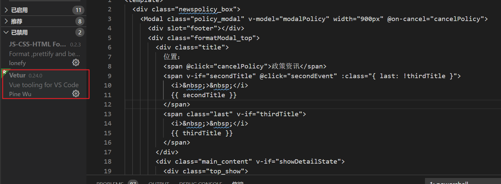
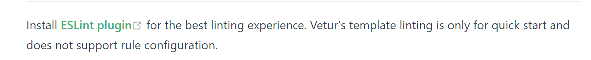

# 好用的插件-VSCode

## Chinese (Simplified) Language Pack for Visual Studio Code

> VSCode 汉化

## Code Runner

```
我通常会在vs上用js写算法题，但是想直接运行的话不太方便（可以以调试的形式运行，需要配置，详情参见  ），于是乎可以使用 `Code Runner`
```


##  Live Server

```
可以默认起一个服务器，去运行你的HTML，改的的话，不需要刷新就可以看到改动
```


## open in browser

```
在默认浏览器打开你的HTML页面
```

`vetur` 、`ESlint`、`Prettier`都是用来检查代码规范的，这一些插件都有啥区别 🤣？

`ESlint`：负责质量检测

`Prettier`：负责风格检测

## Vetur（在Vue项目中的应用）

Vetur能提供的功能:

+ Syntax Highlighting(代码高亮)

没有使用前，代码灰蒙蒙一片：



使用后，像极了我戴眼镜看世界的样子：


+ Snippet(代码片段)
+ Emmet(Emmet语法)
+ Linting / Error Checking(代码校验/错误检查)



​	Vetur的Linting不支持修改，还需要安装`ESLint`。

+ Formatting
+ IntelliSense
+ Debugging
+ Framework Support
+ Interpolation Support
+ VTI

## ESlint

## Prettier

## Bracket Pair Colorizer 2

## Code Spell Checker