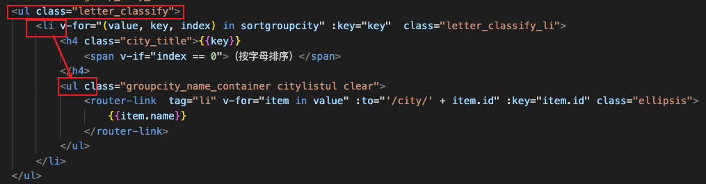
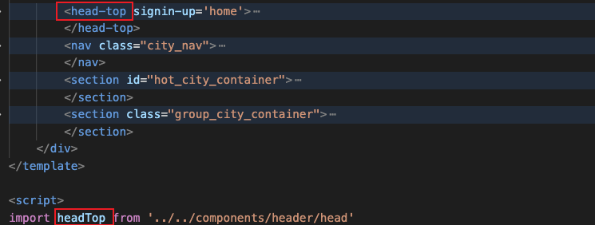
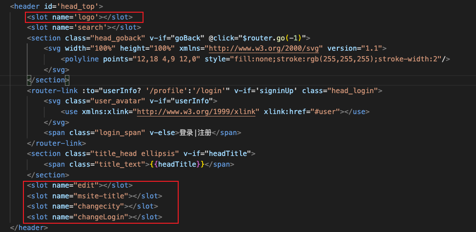
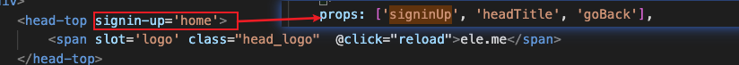
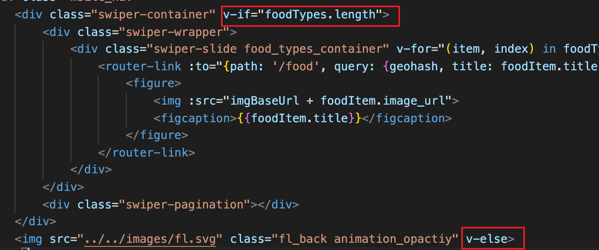

1.  ul li可以相互包含

2. 组件

   名字：例如组件的引入名字是： MycomponentName，在模板中: <my-component-name></my-component-name>

   

   slot：对于一个通用的组件，但在每个对其引用的组件其表现形式有所不同，可以使用slot

   ​					

   传参：
   
   动态组件：
   
   ​	使用<keep-alive></keep-alive>缓存被创建的组件，组件要有自己的名字。

3. 插件
   + Swiper：滑动
   + better-scroll：滚动

4. 代码书写风格

   

5. 用户体验

   * 数据没加载出来的过渡效果

     使用transition封装

# 我的不足

* 路由的使用（路由与组件解耦，语法）
* Vue过渡效果 （https://cn.vuejs.org/v2/guide/transitions.html）

